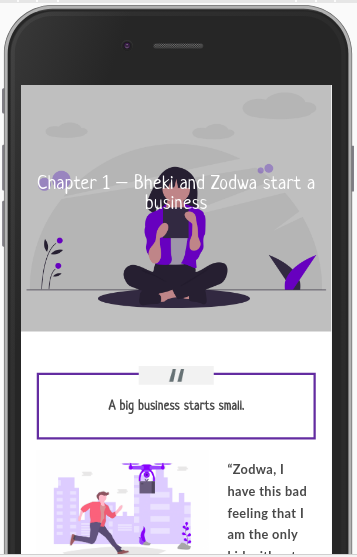

# NACCW Reading and Writing bookclub

###  About : A Progressive web application for stories written by the benefitiaries of NACCW

## How to send story?

Visit the website [link](https://wordpress-8275-0.cloudclusters.net/) to upload the story as a registered user

## How to read the story?

Visit the website [link](https://wordpress-8275-0.cloudclusters.net/) to read as a non-registered user

## Accesibility?

Use modern browser on mobile, desktop or laptop to visit the link then add the link to home screen in order to access it as an app

## Developer:

[Nompumelelo](https://github.com/elolelo) 
